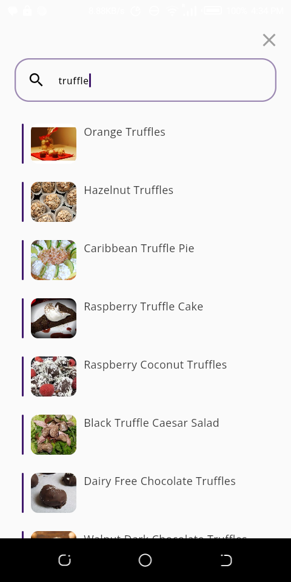
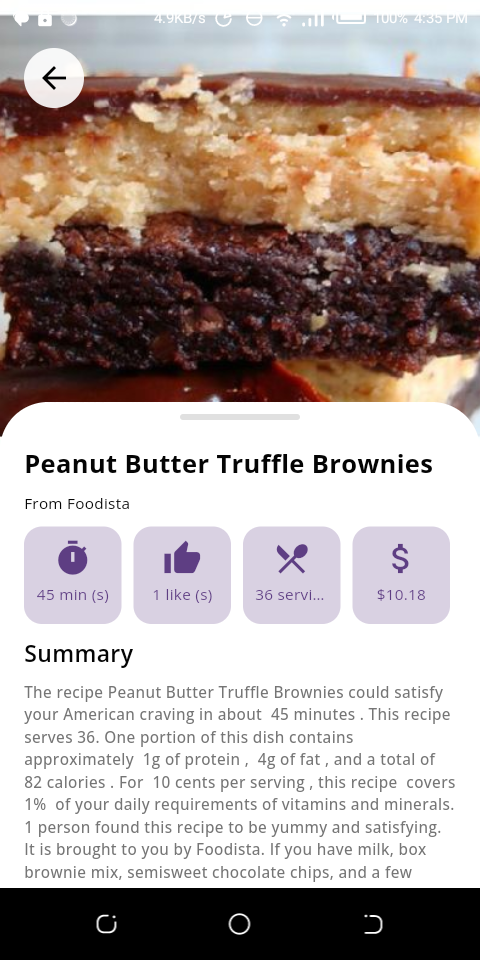
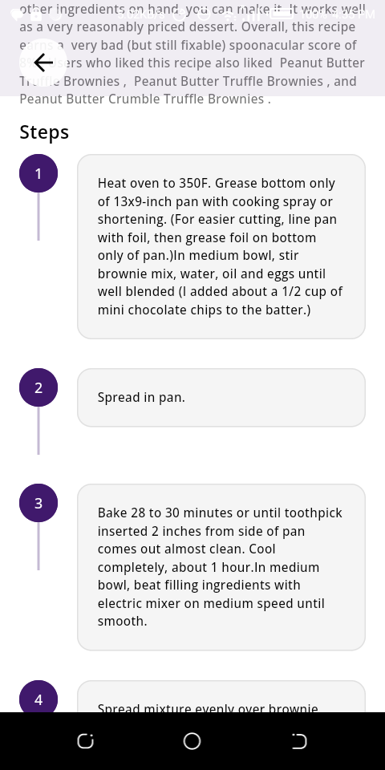

# Flutter Recipe App

A beautifully designed recipe application built with Flutter and GetX, featuring
recipe discovery, search, and detailed cooking instructions.

## Features

- 🍳 Browse trending recipes
- 🔍 Search functionality with debounce
- 📱 Responsive design
- ⚡ Fast image loading with caching
- 💫 Smooth loading animations
- 🌗 Elegant UI with skeleton loading
- 🎯 State management with GetX

## Screenshots

### Home


### Search



### Recipe Details

 

## Getting Started

### Prerequisites

- Flutter SDK
- Dart SDK
- IDE (VS Code or Android Studio)

### Installation

1. Clone the repository

```bash
git clone https://github.com/Adisa-Shobi/recipe_app
```

2. Install dependencies

```bash
flutter pub get
```

3. Create `.env` file in root directory

```env
RAPIDAPI_HOST=spoonacular-recipe-food-nutrition-v1.p.rapidapi.com
RAPIDAPI_KEY=your_api_key_here
```

4. Run the app

```bash
flutter run
```

## Code Examples

### Project Structure

```
lib/
  ├── components/           # Reusable widgets
  ├── config/              # App configuration
  ├── controllers/         # GetX controllers
  ├── models/             # Data models
  ├── screens/            # App screens
  ├── services/           # API services
  ├── utils/             # Utility functions
  └── main.dart          # Entry point
```

### Dependencies

```yaml
dependencies:
  cupertino_icons: ^1.0.6
  get: ^4.6.6
  connectivity_plus: ^6.1.0
  http: ^1.2.2
  logger: ^2.5.0
  dots_indicator: ^3.0.0
  intl: ^0.19.0
  flutter_dotenv: ^5.2.1
  shimmer: ^3.0.0
```

### API Client

```dart
class ApiClient {
  final String baseUrl;
  final Duration timeout;
  final Map<String, String> defaultHeaders;

  ApiClient({
    required this.baseUrl,
    this.timeout = const Duration(seconds: 30),
    this.defaultHeaders = const {},
  });

  Future<ApiResponse<T>> get<T>(
    String endpoint, {
    Map<String, String>? headers,
    Map<String, dynamic>? queryParameters,
    required T Function(Map<String, dynamic>) fromJson,
  }) async {
    // Implementation...
  }
}
```

### Environment Setup

```dart
class MainController extends GetxController {
  late final ApiClient apiClient;

  @override
  Future<void> onInit() async {
    super.onInit();
    await dotenv.load(fileName: ".env");
    
    apiClient = ApiClient(
      baseUrl: 'https://spoonacular-recipe-food-nutrition-v1.p.rapidapi.com',
      defaultHeaders: {
        "x-rapidapi-host": dotenv.env['RAPIDAPI_HOST'] ?? '',
        "x-rapidapi-key": dotenv.env['RAPIDAPI_KEY'] ?? '',
      },
    );
  }
}
```

### Recipe Card

```dart
class RecipeCard extends StatelessWidget {
  final String imageUrl;
  final String title;
  final String description;
  final String cookTime;

  const RecipeCard({
    super.key,
    required this.imageUrl,
    required this.title,
    required this.description,
    required this.cookTime,
  });

  @override
  Widget build(BuildContext context) {
    return Container(
      height: MediaQuery.of(context).size.height * 0.55,
      decoration: BoxDecoration(
        color: Colors.white,
        borderRadius: BorderRadius.circular(16),
        boxShadow: [
          BoxShadow(
            color: Colors.black.withOpacity(0.1),
            blurRadius: 8,
            offset: const Offset(0, 2),
          ),
        ],
      ),
      child: Stack(
        // Implementation...
      ),
    );
  }
}
```

### Skeleton Loading

```dart
class RecipeCardSkeleton extends StatelessWidget {
  const RecipeCardSkeleton({
    super.key,
    this.height,
    this.padding,
    this.borderRadius,
  });

  @override
  Widget build(BuildContext context) {
    return Container(
      height: height ?? MediaQuery.of(context).size.height * 0.55,
      decoration: BoxDecoration(
        color: Colors.white,
        borderRadius: borderRadius ?? BorderRadius.circular(16),
        boxShadow: [
          BoxShadow(
            color: Colors.black.withOpacity(0.1),
            blurRadius: 8,
            offset: const Offset(0, 2),
          ),
        ],
      ),
      child: Shimmer.fromColors(
        // Implementation...
      ),
    );
  }
}
```

### Search with Debounce

```dart
Timer? _debounceTimer;

@override
void onInit() {
  super.onInit();
  
  searchController.value.addListener(() {
    if (_debounceTimer?.isActive ?? false) _debounceTimer?.cancel();
    
    _debounceTimer = Timer(
      const Duration(milliseconds: 500),
      () => searchRecipes(searchController.value.text),
    );
  });
}
```

## Features Implementation

### Image Handling

- Cached network images for better performance
- Skeleton loading while images load
- Fallback images for failed loads
- Responsive image sizing

### State Management

- GetX for reactive state management
- Controllers for business logic
- Dependency injection
- Route management

### API Integration

- RESTful API integration
- Error handling
- Response parsing
- Request caching

### UI/UX

- Skeleton loading states
- Smooth animations
- Responsive design
- Error states
- Loading indicators

## Contributing

1. Fork the repository
2. Create your feature branch (`git checkout -b feature/AmazingFeature`)
3. Commit your changes (`git commit -m 'Add some AmazingFeature'`)
4. Push to the branch (`git push origin feature/AmazingFeature`)
5. Open a Pull Request

## License

This project is licensed under the MIT License - see the [LICENSE](LICENSE) file
for details.

## Acknowledgments

- [GetX](https://github.com/jonataslaw/getx) for state management
- [Spoonacular API](https://spoonacular.com/food-api) for recipe data
- [Flutter Documentation](https://flutter.dev/docs)
